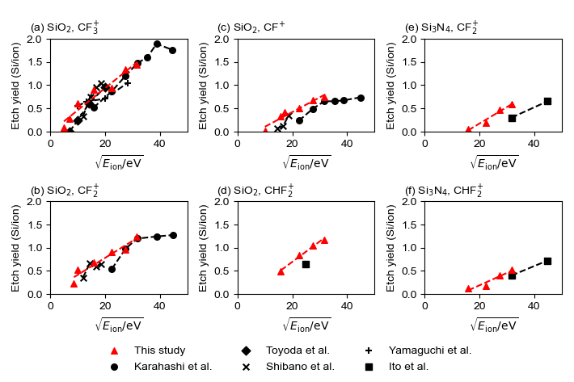
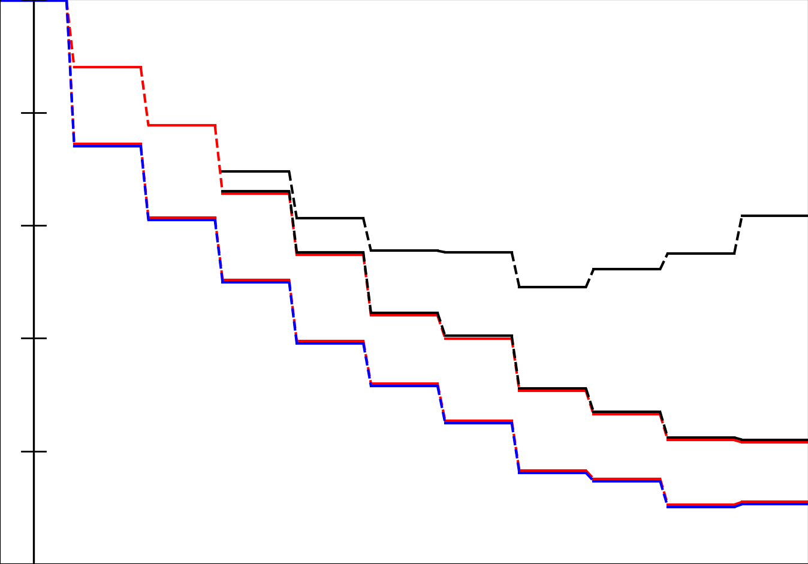
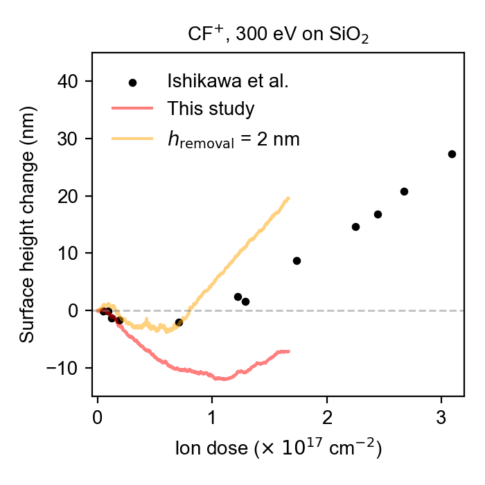
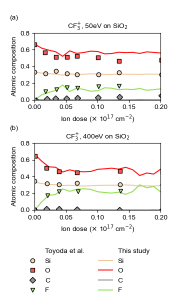
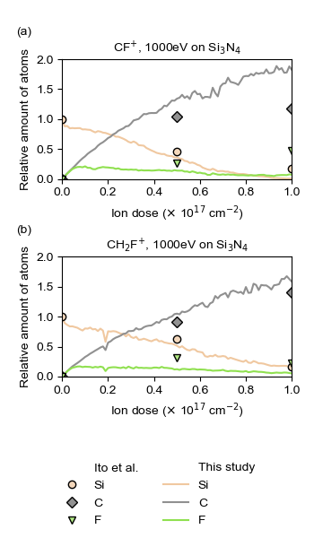

# Scripts used for drawing figures in the paper
## Main figures
### Figure 3
1. Data generation: `etch_yield/get_data/batch_run.py`, using the binary
   compiled from `etch_yield/get_data/fast_cpp/main.cpp` (use `compile.sh`
   within the folder). Also refer to `etch_yield/get_data/path.yaml`.
   (Or one may use `etch_yield/plot_profile.py` for generation with python.)
2. Plot `etch_yield/plot_with_experiments/plot.py`. Etch yield data should be
   written in `etch_yield/plot_with_experiments/dat.yaml`.

    

### Figure 4
1. Generate merged structures using `atom_config/merge.py` with
   `atom_config/input.yaml`.
   (Example structures are in `atom_config/example/`)
2. Create overlay figure using `atom_config/overlay/plot.py`.

    

### Figure 5
1. Data generation: use `height_analysis/main.py` with `height_analysis/input_SiO2.yaml`
   (usage in `height_analysis/cmd_SiO2.sh`.)
   The data used in Figure 5 are already in `height_change/SiO2/`.
2. Plot `height_change/SiO2/plot.py` using `height_change/SiO2/data_list.yaml`

    

### Figure 6
1. Data generation & plot: use `surface_composition/SiO2/plot.py` with
   `surface_composition/SiO2/input.yaml`. The data used in Figure 6 are already
   in `surface_composition/SiO2/`.

    

### Figure 7
1. Refer to Figure 6.

    

### Figure 8
1. Plot with `regime_overview/plot.py` using `regime_overview/data.yaml`.

### Figure 10
1. Data generation: refer to Figure 5.
2. Modify `height_analysis/main.py` to run `DataPlotterSelected` instead of
   `DataPlotter`. (`yaml` file should also be modified.)

### Figure 12
1. Refer to Figure 10.

## Supplementary figures
### Figure S1
1. Run `coordNumAnalysis/plot.py` using `coordNumAnalysis/structure_list` and
   `coordNumAnalysis/cutoff_matrix.npy`.

### Figure S2
1. Run `train_results/parity_plot/plot.py` using
   `train_results/parity_plot/input.yaml`.

### Figure S3
1. Run `train_results/iter_learn/plot.py` using
   `train_results/iter_learn/input.yaml`.

### Figure S4
1. Generate data using `rxnEnergy/get_data/main.py` and
   `rxnEnergy/get_data/input.yaml`. Refer to example: `rxnEnergy/get_data/cmd.sh`.
2. Plot using `rxnEnergy/plot_from_log.py`.
   (Data are in `rxnEnergy/data/`.)

### Figure S5
1. Data generation: refer to Figure 3.
2. Plot `etch_yield/plot_overview/plot_overview.py`. Paths of etch yield should
   be written in `etch_yield/plot_overview/path.yaml`.

### Figure S6
1. Data generation: refer to Figure 3.
2. Plot `etch_yield/plot_profile_single.py`. `etch_yield/CF_300.dat` was used.

### Figure S7
1. Run `removal_height_check/check_removal_height.py` (refer to
   `removal_height_check/batch.j`).

### Figure S8
1. Data generation: refer to Figure 6.
   (Use data in `surface_composition/SiO2/CF_300/`)

### Figure S9
1. Data generation: refer to Figure 5.
   (Use data in `height_change/Si3N4/`.)

### Figure S10
1. Data generation: `byproducts/get_data/gen_mol_dict.py`.
   (Data used are in `byproducts/get_data/data/`).
2. Plot: `byproducts/plot.py`.

### Figure S11
1. Use `height_analysis/profile_example/plot_profile.py`.

### Figure S12
1. Refer to Figure S11.

### Figure S13
1. Refer to Figure 10. (results are in
   `height_analysis/data/SiO2_CF_300/sensitivity_analysis/`.)

### Figure S14
1. Refer to Figure 5. (results are in `height_analysis/data/SiO2_total/`.)

### Figure S15
1. Refer to Figure S10. (results are in `byproducts/get_data/data/SiO2/`.)

### Figure S16
1. Refer to Figure 5. (results are in `height_analysis/data/SiO2_CH2F_250/`.)

### Figure S17
1. Refer to Figure 5. (results are in `height_analysis/data/Si3N4_total/`.)

### Figure S18
1. Refer to Figure S10. (results are in `byproducts/get_data/data/Si3N4/`.)

### Figure S19
1. Refer to Figure 5. (results are in `height_analysis/data/Si3N4_CF2_CF3_250/`.)

### Figure S20
1. Refer to Figure 5. (results are in `height_analysis/data/Si3N4_CF_500_750_1000/`.)

### Figure S21
1. Refer to Figure S10. (results are in `byproducts/statistics/`.)

### Figure S22
1. Refer to Figure 5. (results are in `height_analysis/data/Si3N4_CF3_1000/`.)

### Figure S23
1. Plot using `sputter_analysis/plot.py`.

### Figure S24
1. Refer to Figure 5. (results are in `height_analysis/data/Si3N4_CH2F_250/`.)

# Other scripts
