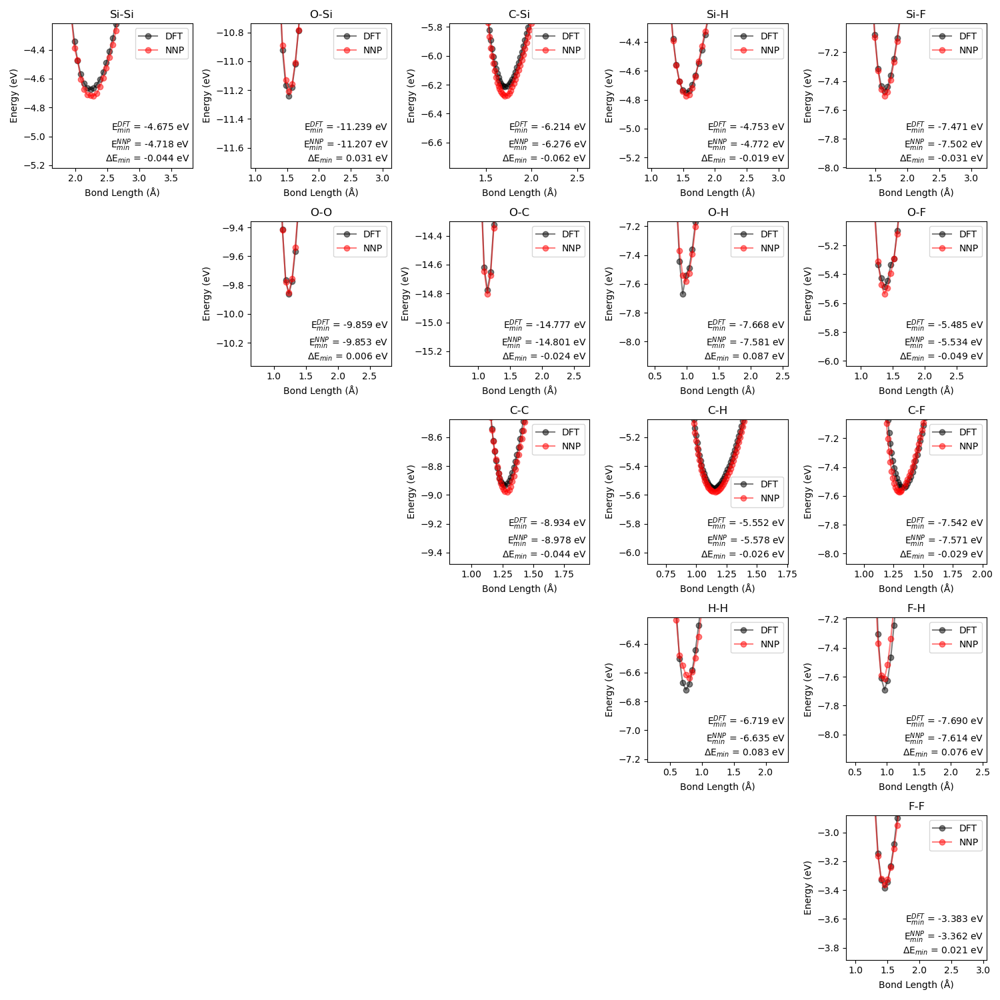
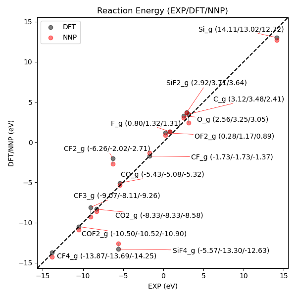
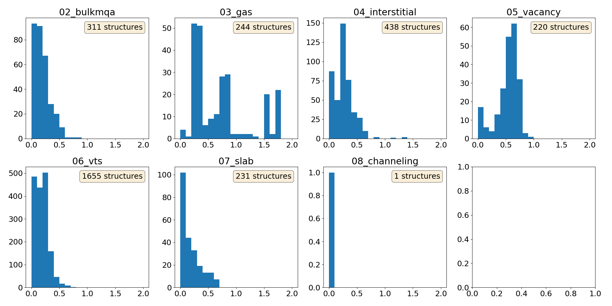
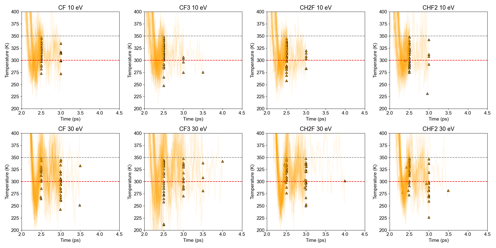
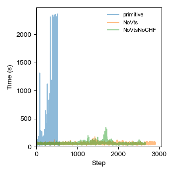

# dimer EOS

    

# Formation energy (EXP vs. DFT/NNP)

    

# Residual spin in training set OUTCARs

    

# Halting temperature check in iterative learning

    

# Elapsed walltime comparison

    

# Trainset_overview
Representative POSCARs in `trainset_overview/poscars/`.

# Vts_effect
Input files for checking the VTS effect in potential quality: `vts_effect/`.

# Overleaf_trainingset_table
Generate the training set table in LaTeX format: `overleaf_trainingset_table/`.

# Others
- structure_analysis
- carbon_film
- etch_statistics
