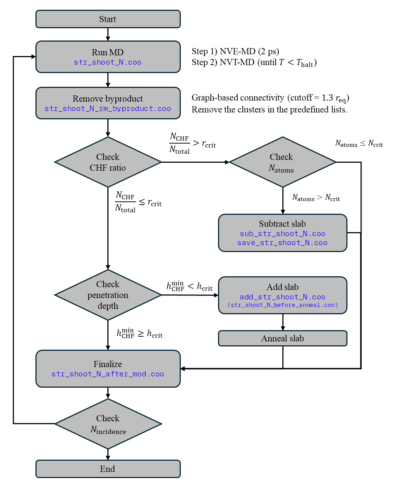

# Plasma Simulator (Etching MD simulation)
See `SM_codes/README.md`.

To use `pair_d2` and `pair_zbl` in LAMMPS, it must be compiled with the files in `lammps/`.

    

---

# Data, figures, and scripts used in the paper
## Training set generation
See `generate_trainset/README.md`.

## Potential Files
- SiO2 (simple-nn): `pot/simplenn/SiO2/potential_saved_bestmodel`
- Si3N4 (simple-nn): `pot/simplenn/Si3N4/pot_SiNCHF_new`

For usage, refer to [SIMPLE-NN](https://github.com/MDIL-SNU/SIMPLE-NN_v2) github.

## Figures
See `Figure/README.md`.

## Cite
An, H., Oh, S., Lee, D., Ko, J. H., Oh, D., Hong, C., & Han, S. (2025). Etching-to-deposition transition in SiO2/Si3N4 using CHxFy ion-based plasma etching: An atomistic study with neural network potentials. *Applied Surface Science*, 164601. [link](https://www.sciencedirect.com/science/article/pii/S0169433225023177)
